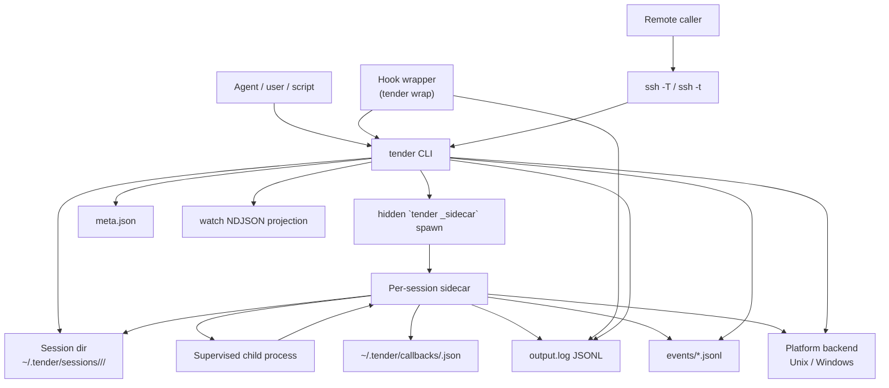

# System Context

Tender is a transactional CLI over a durable per-session record and a
per-session sidecar. The sidecar normally owns process lifecycle and log
capture; after it is gone, CLI reconciliation may heal or infer terminal
state. The CLI creates or queries sessions, writes control requests, and exits.

Responsibility split:

- The CLI is transactional. It parses arguments, resolves namespaces, writes control requests, and reads persisted state.
- The sidecar is the normal lifecycle authority. It holds the session lock, spawns the child, writes run-state transitions, captures output, and classifies exit; reconciliation is the narrowly scoped CLI exception.
- The durable session record has three authorities: `meta.json` for the current run snapshot, `output.log` for child output, and `events/*.jsonl` for lifecycle/provenance history.
- SSH is only a transport wrapper. It forwards selected CLI commands to a remote Tender binary; it does not define a second lifecycle model.

What this diagram omits:

- exact session-file names, which are covered in [02-session-storage.md](02-session-storage.md)
- exact state transitions, which are covered in [03-run-lifecycle.md](03-run-lifecycle.md)
