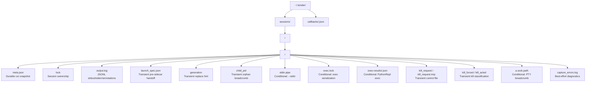

# Session Storage

Tender persists one directory per session under `~/.tender/sessions/<namespace>/<session>/`. Some files are durable record, some are transient control breadcrumbs, and some exist only for specific execution lanes.

Durable by design:

- `meta.json`
- `output.log`
- `callbacks/<run_id>.json`

Transient / control-plane artifacts:

- `launch_spec.json`
- `generation`
- `child_pid`
- `kill_request*`
- `kill_forced`
- `kill_acted`
- `exec.lock`
- `exec-results/*`
- `stdin.pipe`
- `a.sock.path`

Session directory rules:

- `meta.json` is written atomically via temp-file + rename.
- `output.log` is append-only JSONL:
  - `O` for stdout / PTY merged output
  - `E` for stderr on pipe sessions
  - `A` for annotations written by `wrap` and `exec`
- PTY attach uses a Unix socket stored in the system temp directory, with `a.sock.path` as the breadcrumb back to the real socket path.

What this diagram omits:

- the run state machine encoded inside `meta.json`
- the specific control semantics of `stdin.pipe`, `kill_request`, and PTY attach
