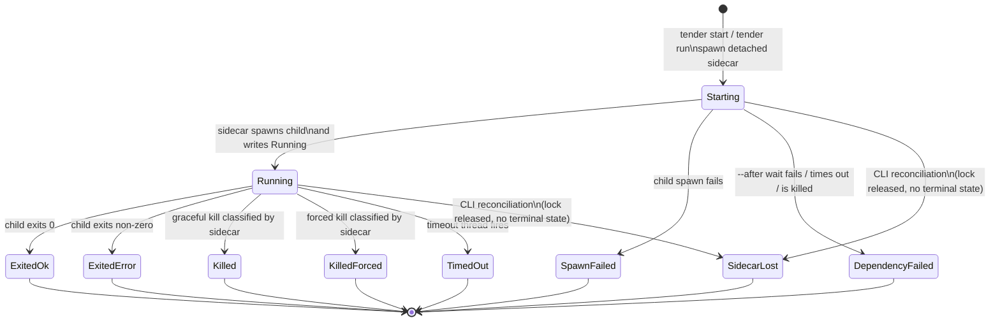

# Run Lifecycle

Tender models supervised runs, not raw processes. The sidecar is the normal writer of lifecycle state. The CLI only writes lifecycle state in one reconciliation case: `SidecarLost`.

Authority rules:

This ownership boundary follows Theme 2: One Authority Per Fact; see [../design-principles.md](../design-principles.md).

- Normal lifecycle writes happen in the sidecar:
  - `Starting -> Running`
  - `Starting -> SpawnFailed`
  - `Starting -> DependencyFailed`
  - `Running -> Exited* / Killed* / TimedOut`
- `SidecarLost` is the only reconciliation write performed outside the sidecar:
  - `status`
  - foreground `run`

Important implementation detail:

- dependency waits happen while the run is still in `Starting`
- if `--after` is present, the sidecar writes `Starting` and signals readiness before it begins polling dependencies
- dependency binding is by `(session, run_id)`, so `--replace` on a dependency causes the waiter to fail rather than silently following a different execution

What this diagram omits:

- the OS-specific mechanics of kill, wait, and process identity
- PTY control, which is separate from run lifecycle and covered in [04-pty-lane.md](04-pty-lane.md)
