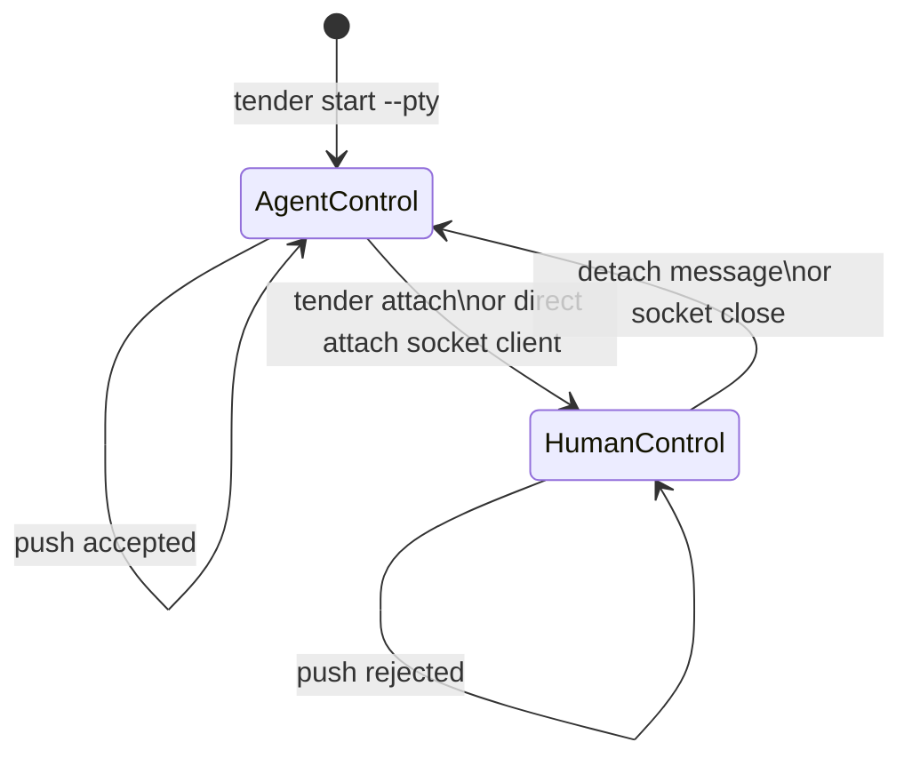
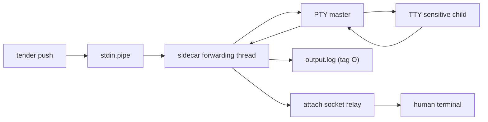

# PTY Lane

Tender has two execution lanes:

- pipe sessions: machine-friendly, `push` + `exec`, separate stdout/stderr
- PTY sessions: terminal-friendly, merged transcript, `push` + `attach`, no generic shell `exec`

This file describes the current PTY implementation on `main`, not the planned lease extension.

Current PTY rules:

- `start --pty` spawns the child under a PTY; the sidecar owns the PTY master
- `push` writes raw bytes into the PTY input path
- `attach` connects a human terminal over a Unix socket and steals control
- while a human is attached, `push` is rejected
- PTY output is merged and recorded as `O` lines in `output.log`

PTY-specific I/O shape:

Important exception:

- generic shell `exec` is rejected on PTY sessions
- `ExecTarget::PythonRepl` is the implemented exception: it uses a side-channel result file instead of transcript scraping, so PTY Python REPL sessions can still support `exec`

Planned but not yet implemented:

- lease-backed exclusive PTY ownership
- token-authorized push headers
- PTY observe mode

Those are described in [../plans/backlog/pty-automation.md](../plans/backlog/pty-automation.md).
