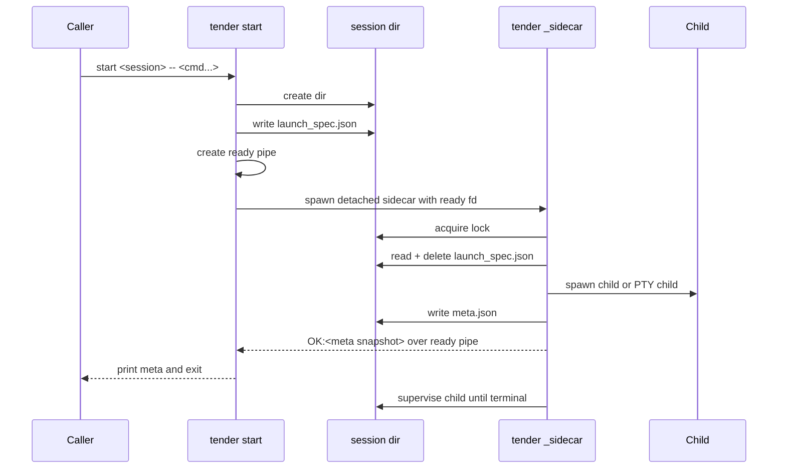
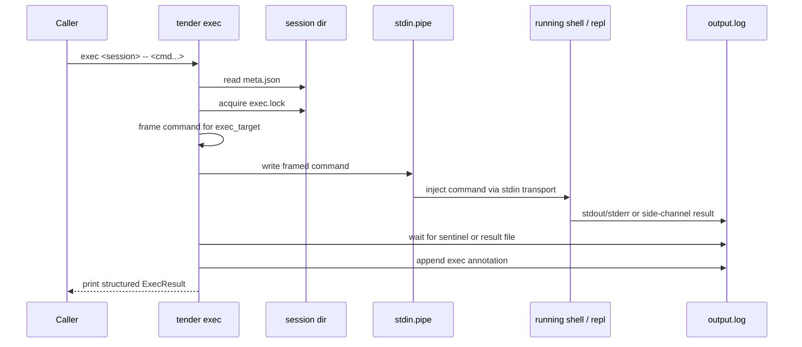
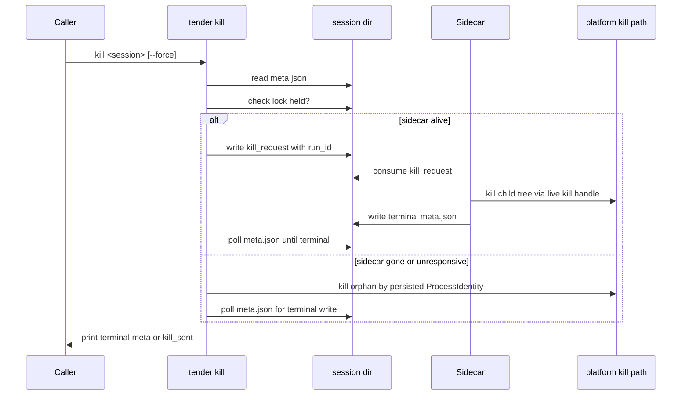
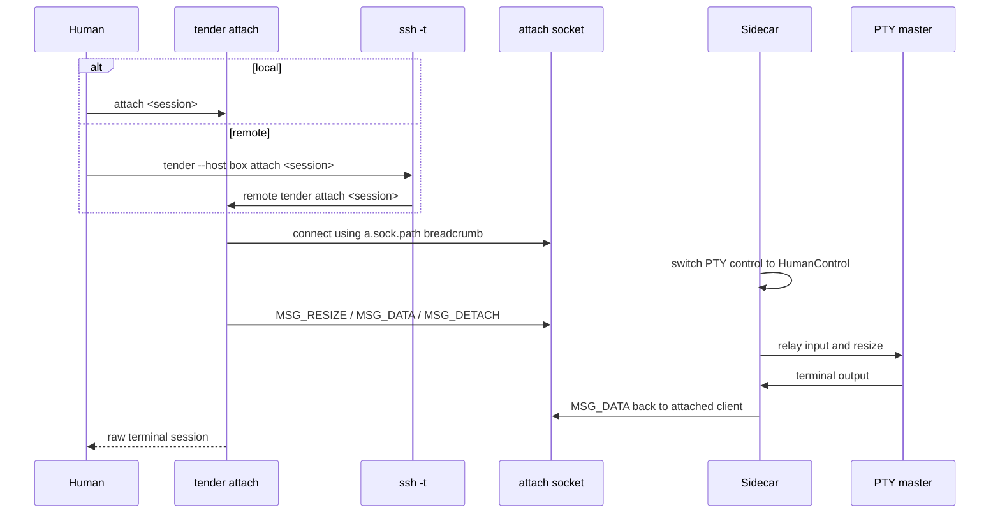

# Key Flows

These are the load-bearing sequences in the current system. They show where the CLI exits, where the sidecar takes over, and which boundaries are file-, pipe-, or socket-based.

## `start`

Notes:

- if dependencies are present, the sidecar writes `Starting` and signals readiness before waiting on `--after`
- if spawn fails, the sidecar returns a `SpawnFailed` snapshot over the ready pipe and the CLI exits non-zero

## `exec`

Notes:

- shell and PowerShell sessions use sentinel lines in `output.log`
- Python REPL uses `exec-results/<token>.json`
- timed-out exec holds `exec.lock` until the shell/repl finishes its frame, so a second exec cannot interleave into a busy session

## `kill`

Notes:

- kill requests are bound to `run_id`, so stale control files from a previous run are ignored
- graceful vs forced kill classification is finalized by the sidecar using `kill_acted` / `kill_forced` breadcrumbs plus timeout state

## `attach` (local and remote)

Notes:

- remote attach is still sidecar-local on the far host; SSH only carries the terminal
- attach uses `ssh -t`, unlike the non-interactive remote commands that use `ssh -T`

## `run`

`run` is a wrapper around `start` for scripts:

- parse directives from the script
- resolve interpreter / shell
- call the same `launch_session` path as `start`
- in foreground mode, follow `output.log` until terminal and then propagate exit code from final `meta.json`

## `wrap`

`wrap` is also a wrapper flow:

- must run inside a Tender-supervised process (`TENDER_RUN_ID` required)
- spawns the wrapped command directly
- captures stdin/stdout/stderr
- appends one `A` line to `output.log`
- exits with the wrapped command's exit code
