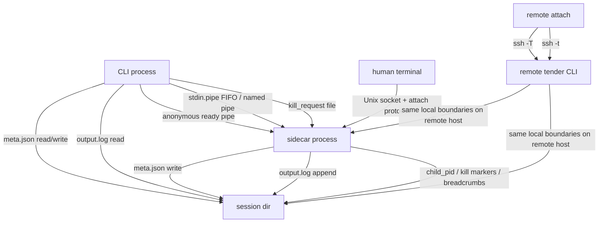

# Transport Boundaries

Tender’s architecture is easier to understand if you separate pure in-process logic from the places where bytes cross a boundary.

Boundary inventory:

- Ready pipe:
  - created by `start`
  - used once for sidecar startup handshake
  - carries `OK:<meta>` or `ERROR:<message>`

- `stdin.pipe`:
  - created when `--stdin` is enabled
  - shared input transport for `push`
  - also used by `exec` to inject framed commands into running shell-like sessions

- `kill_request` file:
  - written by `kill`
  - consumed by the sidecar kill watcher
  - validated against current `run_id`

- `output.log`:
  - append-only JSONL from sidecar and wrapper writers
  - queried directly by `log`
  - projected into NDJSON events by `watch`

- PTY attach socket:
  - local Unix socket on the sidecar host
  - breadcrumbed through `a.sock.path`
  - framed with `MSG_DATA`, `MSG_RESIZE`, `MSG_DETACH`

- SSH transport:
  - forwards only an allowlisted subset of commands today
  - does not invent a separate event model or remote session store

What stays in-process:

- `Meta` transition methods
- launch-spec hashing and idempotency checks
- watch event formatting once state/log lines have been read
- annotation payload construction before append

Current remote-command scope:

This split follows Theme 5: Separate Control Plane From Work Plane; see [../design-principles.md](../design-principles.md).

- supported over `--host`: `start`, `status`, `list`, `log`, `push`, `kill`, `wait`, `watch`, `attach`
- local-only: `run`, `exec`, `wrap`, `prune`

Why `exec` is local-only: it needs coordinated access to the session's FIFO, `exec.lock`, `output.log` scan, and side-channel result files (`exec-results/<token>.json` for Python REPL). That's shared-filesystem IPC, not a one-shot RPC. `ssh -T` cannot represent it without building a second lifecycle protocol, which the design explicitly rejects.

The workaround is first-class: `ssh host 'tender exec <session> -- <cmd>'`. The remote `tender` does the local IPC on the remote host exactly as it would locally. Same holds for `run`, `wrap`, `prune`.
