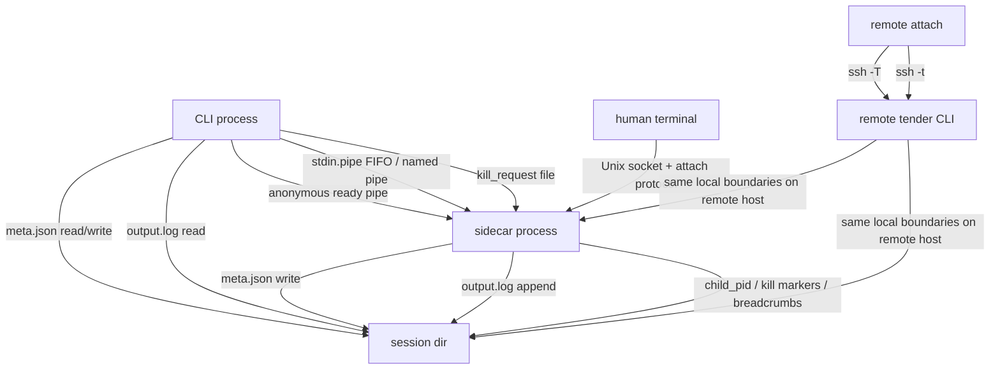

# Transport Boundaries

Tender’s architecture is easier to understand if you separate pure in-process logic from the places where bytes cross a boundary.

Boundary inventory:

- Ready pipe:
  - created by `start`
  - used once for sidecar startup handshake
  - carries `OK:<meta>` or `ERROR:<message>`

- `stdin.pipe`:
  - created when `--stdin` is enabled
  - shared input transport for `push`
  - also used by `exec` to inject framed commands into running shell-like sessions

- `kill_request` file:
  - written by `kill`
  - consumed by the sidecar kill watcher
  - validated against current `run_id`

- `output.log`:
  - append-only JSONL from sidecar and wrapper writers
  - queried directly by `log`
  - projected into NDJSON events by `watch`

- PTY attach socket:
  - local Unix socket on the sidecar host
  - breadcrumbed through `a.sock.path`
  - framed with `MSG_DATA`, `MSG_RESIZE`, `MSG_DETACH`

- SSH transport:
  - forwards only an allowlisted subset of commands today
  - does not invent a separate event model or remote session store

What stays in-process:

- `Meta` transition methods
- launch-spec hashing and idempotency checks
- watch event formatting once state/log lines have been read
- annotation payload construction before append

Current remote-command scope:

This split follows Theme 5: Separate Control Plane From Work Plane; see [../design-principles.md](../design-principles.md).

- supported over `--host`: `start`, `status`, `list`, `log`, `push`, `kill`, `wait`, `watch`, `attach`, `exec`
- local-only: `run`, `wrap`, `prune`

How `exec` goes remote: the whole exec request is serialized as one JSON frame and streamed to a remote `tender exec --frame-from-stdin` over the ssh stdin channel. The shared-filesystem IPC that exec needs — the session's FIFO, `exec.lock`, `output.log` scan, and side-channel result files (`exec-results/<token>.json` for Python REPL) — all runs locally on the *remote* host exactly as it would for a local exec; only the request frame and the JSON result envelope cross the ssh boundary. That is a one-shot request/response, so no second lifecycle protocol is needed. (The earlier design treated `exec` as local-only for the IPC reasons above; the frame transport resolved it — see the remote-exec-host-parity plan.)

`run`, `wrap`, and `prune` stay local-only by design: `--host` on those exits 2 with a pre-filled `ssh host 'tender <cmd>'` fallback. `wrap` additionally needs the supervised-process environment, so it only makes sense inside a tender-supervised process on the target host.

## Execution-environment boundaries

Tender's IPC is process-native and filesystem-local. That means every IPC primitive assumes a shared filesystem + same UID within a single trust domain. When sessions run inside containers, VMs, or across hosts, the question is not "does Tender work?" — it's "where does the session dir live?"

Five axes define the boundary relationship between Tender and any execution environment:

| Axis | Tender's position |
|------|-------------------|
| **Identity** | `ProcessIdentity { pid, start_time_ns }` — process-native, no container/VM ID concept |
| **Lifecycle** | `RunStatus` state machine — process-native; container states like `paused`/`restarting` are out of scope |
| **Authority** | The kernel (process tables, signals) — not a container daemon |
| **Boundaries** | Implicit — whatever process tree is visible to the sidecar |
| **IPC** | Shared filesystem + local sockets — works inside any boundary that satisfies those assumptions |

The practical consequence:

- **Tender inside a container** is the cleanest pattern for persistent shells/REPLs. Tender owns the child directly; all IPC works normally.
- **Tender outside, supervising `docker run ...`** works for foreground container jobs. Tender supervises the `docker` client process, not the container object. Do not use with detached containers (`docker run -d`) — Tender would supervise the short-lived client and lose the real workload.
- **Cross-container session sharing** violates *Theme 2: One authority per fact*. Shared volumes for artifacts are fine; shared volumes for multiple Tender instances mutating the same session state are not.

Tender does not model containers, VMs, or orchestrators as first-class objects. The `Boundary` metadata field (shipped 2026-07-10) *describes* where a session runs without *managing* that environment. See [../plans/completed/2026-07-10-boundary-metadata.md](../plans/completed/2026-07-10-boundary-metadata.md).
